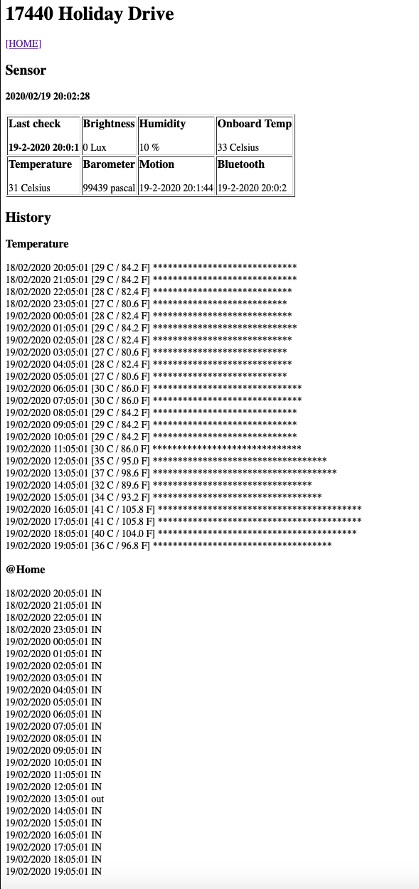

# sensor pi


# notes on running flask
Externally Visible Server
If you run the server you will notice that the server is only accessible from your own computer, not from any other in the network. This is the default because in debugging mode a user of the application can execute arbitrary Python code on your computer.

If you have the debugger disabled or trust the users on your network, you can make the server publicly available simply by adding --host=0.0.0.0 to the command line:

'''flask run --host=0.0.0.0'''
This tells your operating system to listen on all public IPs.

# notes on pairing raspbery pi to iphone
```
sudo hciconfig -a
[bluetooth] scan on
sudo bluetoothctl
# find your Iphone's BT address
[bluetooth] scan off
[bluetooth] pair XX:XX:XX:XX:XX
[bluetooth] exit
```

# links 
- Install flask
    - https://flask.palletsprojects.com/en/1.0.x/quickstart/
- Run flask in the background
    - https://stackoverflow.com/questions/36465899/how-to-run-flask-server-in-the-background
- Git cron
  - https://docs.ansible.com/ansible/latest/modules/cron_module.html
- Who is home - detecting presence of bluetooth device
  - https://www.instructables.com/id/Raspberry-Pi-Bluetooth-InOut-Board-or-Whos-Hom/
  - https://www.raspberrypi.org/forums/viewtopic.php?t=164807

    
